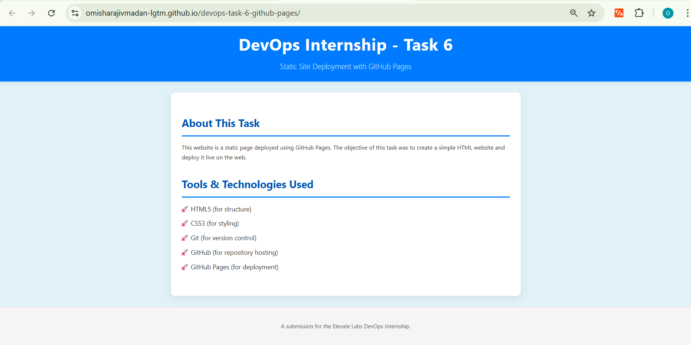

# Task 6: Host a Static Website with GitHub Pages

- **Internship Task:** Task 6 for Elevate Labs DevOps Internship
- **Objective:** Deploy a simple HTML website using GitHub Pages.

---

## 🚀 Live Website Link

**[https://omisharajivmadan-lgtm.github.io/devops-task-6-github-pages/](https://omisharajivmadan-lgtm.github.io/devops-task-6-github-pages/)**

### Final Deployed Site:

---

## 🛠️ Tools Used

* **GitHub:** For version control and repository hosting.
* **GitHub Pages:** As the static site hosting service.
* **HTML5/CSS3:** For creating the website content and styling.
* **Git:** For local version control.

---

## 📝 Process Summary

Here is the step-by-step process I followed to complete the task:

1.  **Website Creation:** I created a clean, styled `index.html` file and a corresponding `css/style.css` file to build a professional-looking landing page.

2.  **Repository Setup:** A new GitHub repository was created for this task. I then initialized Git locally, made several atomic commits (for `.gitignore` and the site files), and pushed the project to the `main` branch.

3.  **GitHub Pages Deployment:** I navigated to the repository's **Settings > Pages** tab.

4.  **Configuration:** I selected the **`main` branch** as the source and the **`/ (root)` folder** to deploy from.

5.  **Verification:** After saving, GitHub provided a live URL. I accessed this link to verify that the website was successfully deployed.

6.  **Update Demonstration:** After the initial deployment, I made a modification to the `style.css` file and pushed the new commit. This successfully demonstrated the CI/CD workflow, as GitHub Pages automatically detected the change and updated the live site.

---

## 💡 Key Concepts & Learnings

*(This section documents my understanding of the tools used.)*

* **What is GitHub Pages?** I learned that GitHub Pages is a static site hosting service that takes HTML, CSS, and JavaScript files straight from a repository and publishes them on the web for free.

* **Static vs. Dynamic:** This task highlights a key feature of GitHub Pages: it's for **static content only**. It cannot run server-side code or connect to a database, making it unsuitable for dynamic applications.

* **Update Workflow:** I confirmed that updating the website is seamless. Any new commit pushed to the configured branch (in this case, `main`) automatically triggers a redeployment of the site.

* **Default File:** The server automatically looks for and serves the `index.html` file as the entry point for the site.

---

## 📚 Further Exploration

As per the internship guidelines, I researched how to use a **custom domain**, which is a feature supported by GitHub Pages but may involve a paid domain purchase.

**Procedure to add a custom domain:**
1.  **Purchase Domain:** Acquire a domain name from a registrar (e.g., GoDaddy, Namecheap).

2.  **GitHub Settings:** In the repository **Settings > Pages** > **Custom domain**, enter the purchased domain name (e.g., `www.my-cool-site.com`) and save.

3.  **DNS Configuration:** Go to the domain registrar's DNS settings.

4.  **Create Records:** Add either `A` records pointing to GitHub's IP addresses or a `CNAME` record pointing to `<YOUR-USERNAME>.github.io`.

5.  **Enable HTTPS:** GitHub Pages provides an "Enforce HTTPS" option once the domain is correctly configured.